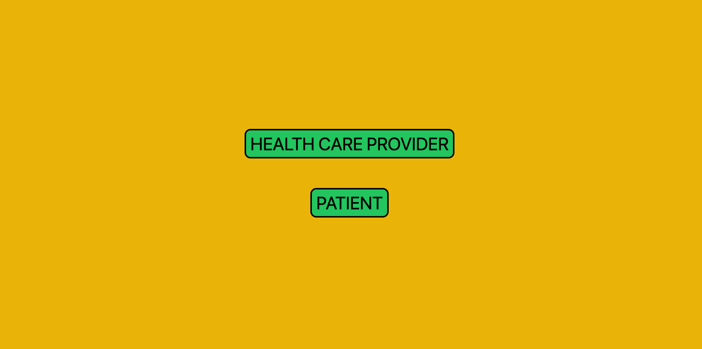
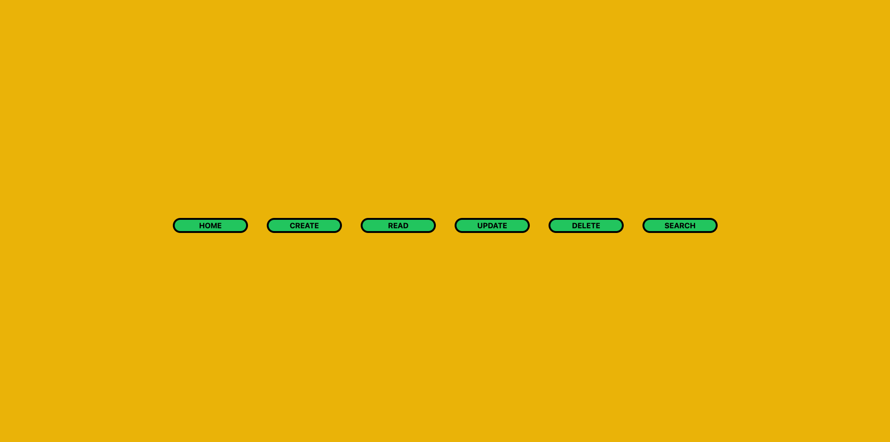
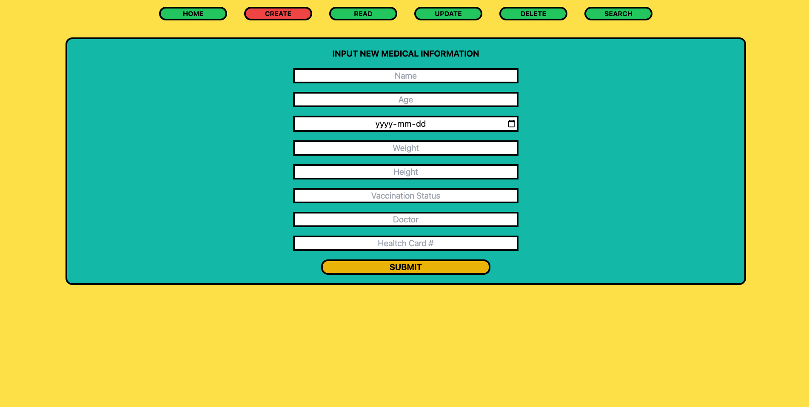
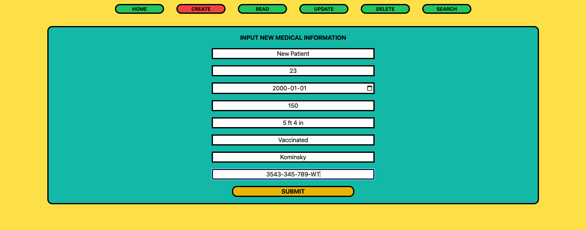
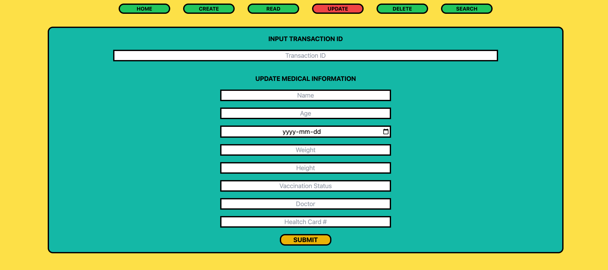
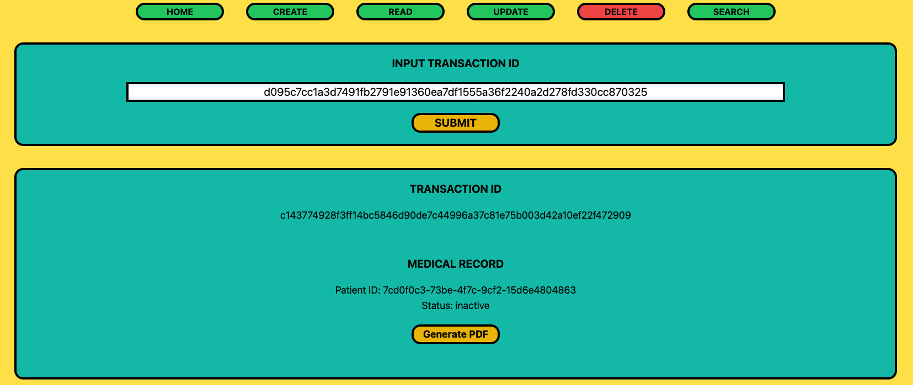
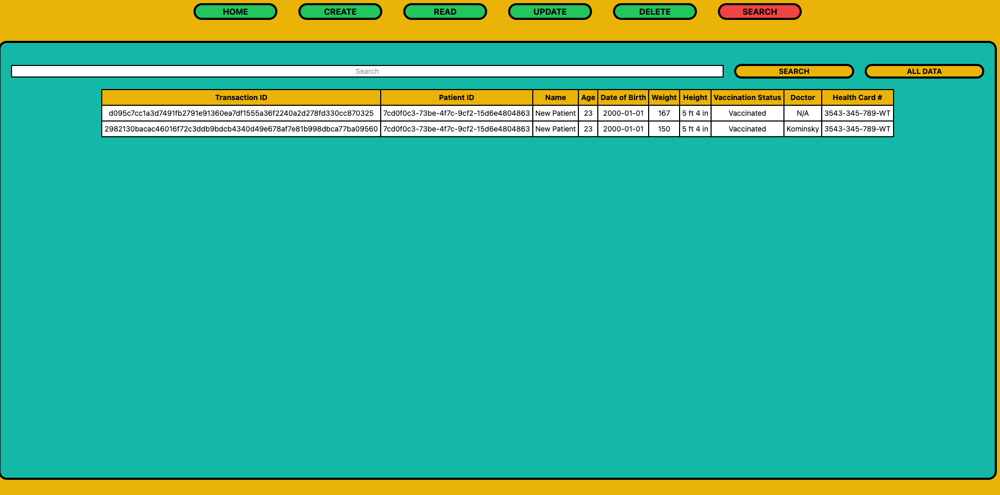

## Purpose
This web application was created for the ULedger Blockchain Hackathon and is used to store medical records on the ULedger blockchain.

## About
This web application was built as a full-stack application used in conjunction with the ULedger Blockchain as a database to create, read, update and delete data held in blockchain transactions running on a public ULedger blockchain. The data in the application deals with medical records. The medical records consist of a person's data that includes Name, Age, Date of Birth, Weight, Height, Vaccination Status, Doctor and Health Card Number. 

The web application has two portals. The health care provider portal provides access to all options to manipulate data on the blockchain which includes create, read, update and delete features. Additionally, a search feature that allows the health care provider to query the blockchain for all transactions or a specific transaction associated to its facility is also present. The patient portal provides access to a read only feature in order to access their medical data for auditing purposes.

The application was built to provide a decentralized way of storing medical records for people. In doing so, it solves the issue of a single point of failure when it comes to how medical records are traditionally stored in our world today: a centralized database that is prone to security issues. These issues may include a hacker gaining access to the centralized medical database and maliciously manipulating the data. The data is also transparent yet protected by ULedger's blockchain technology; prior records are stored on the blockchain and are imutable while updated records can be stored in new transactions.

## Getting Started
1. Fork and clone this repository to your local machine.
2. Navigate to the project root folder.
3. Install dependencies with `npm install`.
4. Create a .env file with the following parameters and input their values into the quotations:
    ```
    NODE_URL=""
    ATOMIC_CLOCK_URL=""
    NODE_ID=""
    BLOCKCHAIN_ID=""
    ```
5. Run the development server with `npm run dev`.
6. Navigate to [http://localhost:3000](http://localhost:3000) in a browser to run the web aplication.

## Languages
- JavaScript
- TypeScript

## Dependencies
- NodeJS
- NextJS
- ReactJS
- TailwindCSS
- Axios
- jsPDF

## Screenshots

### Home Page
Pick between the health care provider or patient portal.


### Options Page
Pick an option to interact with the blockchain.


### Create Page
Create a medical record to be stored on the blockchain.



### Read Page
Input an existing transaction to access the medical record on the blockchain.


### Update Page
Update a medical record on the blockchain with new data.


### Delete Page
Delete a medical record on the blockchain.



### Search Page
Search all medical data associated with transactions related to the health care provider.


## Contributors


[Alric Fernandes](https://github.com/alricf)


[Josh Kelly](https://github.com/7-O-2-H)